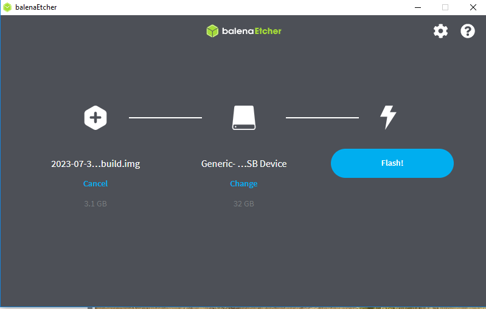

# Installing AirTAK

AirTAK should run on any ARM64-based computer, and is tested on the Raspberry Pi 3 & 4 models. To run AirTAK on a Raspberry Pi, a SD card image will need to be downloaded and written to an SD card. Any SD card larger than 16 GB should suffice to get started, 32 GB recommended.

## Raspberry Pi Imager

[Raspberry Pi Imager](raspberrypi.com/software/) is the preferred utility for creating an AirTAK SD card and runs any Windows, Mac or Linux workstation.

1. Download AirTAK release image to the workstation.
2. Insert an SD card into the workstation.
3. Open Raspberry Pi Imager on the workstation.
4. TK TK

Raspberry Pi Imager Screenshot TK

## balenaEtcher (Balena Ether)

[balenaEther](https://etcher.balena.io/) can be used to create an AirTAK microSD card and runs on any Windows, Mac or Linux workstation.

On the workstation:

1. Download and install [balenaEther](https://etcher.balena.io/).
2. Download the AirTAK microSD card image to your Downloads folder.. TK TK TK
3. Insert the target microSD card.
4. Open blaneEtcher.
5. Select **Flash from file** and locate the AirTAK microSD card image in your Downloads folder.
6. Select the target microSD card.
7. Click **Flash** 

Once balenaEtcher has written the AirTAK microSD card image to the target microSD card, it will verify the image and eject the microSD card from the workstation.

On the target device:

1. Insert the target microSD card into the target device.
2. Power-on (or connect the power to) the target device.

## Next Steps

Within a few seconds of power-up, an AirTAK device will flash green and red lights.

1. Initial startup of a new AirTAK device (either pre-assembled or self-assembled) will take a 120 seconds. During this time the AirTAK device will resize its file system & generate a unique AirTAK Node ID ([NODE_ID](definitions/#NODE_ID)).
2. After initial startup, all AirTAK devices will startup within 90 seconds.

Once an AirTAK device boots, it will establish a WiFi Hotspot with an SSID resembling *AirTAK-XXXX*, where *XXXX* is the last four characters of the NODE_ID.

If you've self-assembled an AirTAK device, you will need to manually set the SDR serial numbers for each SDR installed on the device. See [config](config) page. 

